# Django App

## [VISIT](https://web-production-7a75.up.railway.app/)

Użytkownik **staff** z hasłem **zaq1@WSX** z możliwością wglądu wszystkich danych. Także [panelu admina](https://web-production-7a75.up.railway.app/admin).

Mój pierwszy większy projekt w Django.
Hostowany na stronie [Railway](https://railway.app/).

Dużo funkcji nie jest dokończonych (między innymi cały front jest na absolutnym minimum), jest możliwość wystąpnienia jeszcze błędów, traktowałem to bardziej jako projekt do nauki i testowania funkcji niż pełnoprawną aplikację.

## Funkcje:

1. System Logowania Użytkowników, możliwość przywracania hasła za pomocą email
   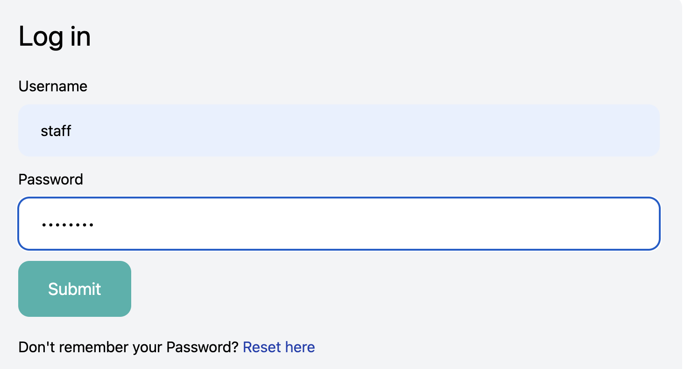
   - Dla każdego użytkownika jest tworzony awatar, jest możliwość zmiany danych
     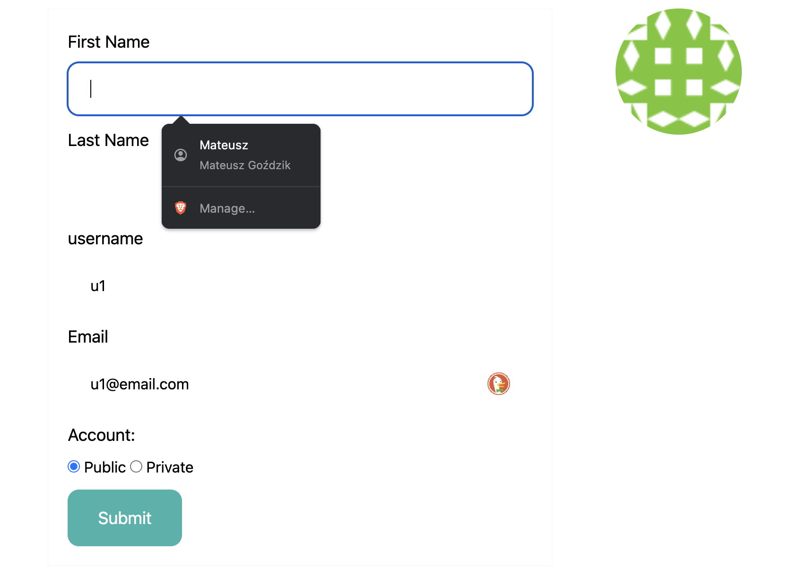
   - Możliwość dodania innego użytkownika (ustawionego jako publiczny) do znajomych, dostanie on wtedy powiadomienie
     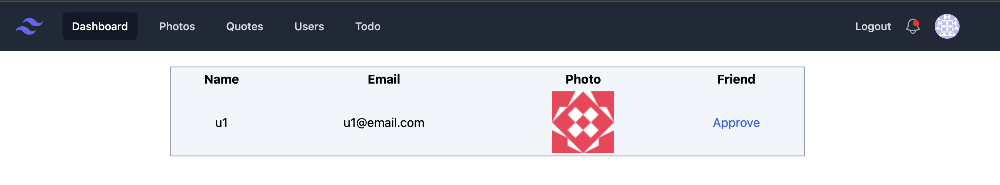
1. Wyświetlanie zdjęć:
   - [kotów](https://thecatapi.com/) i [psów](https://dog.ceo/dog-api/) za pomocą API
     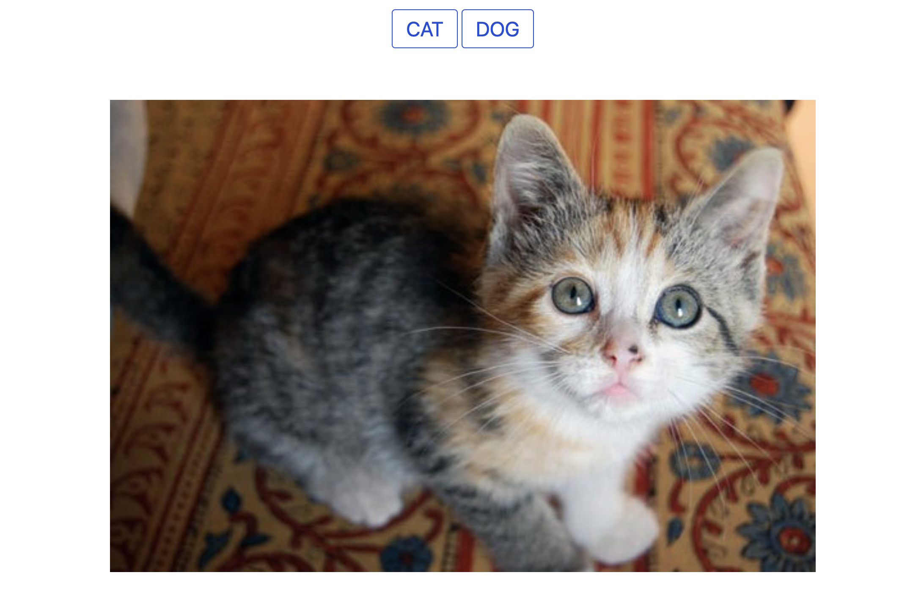
   - Wyłączona funkcja wyświetlania zdjęć z folderu z Google Drive
     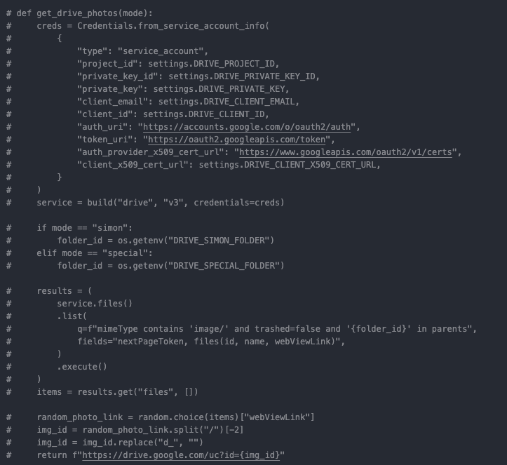
1. System cytatów
   - Można przeglądać cytaty dodane przez admina, dodane przez innych użytkowników (wymagane jest zatwierdzenie ich przez admina), oraz dodanych przez siebie samego.
     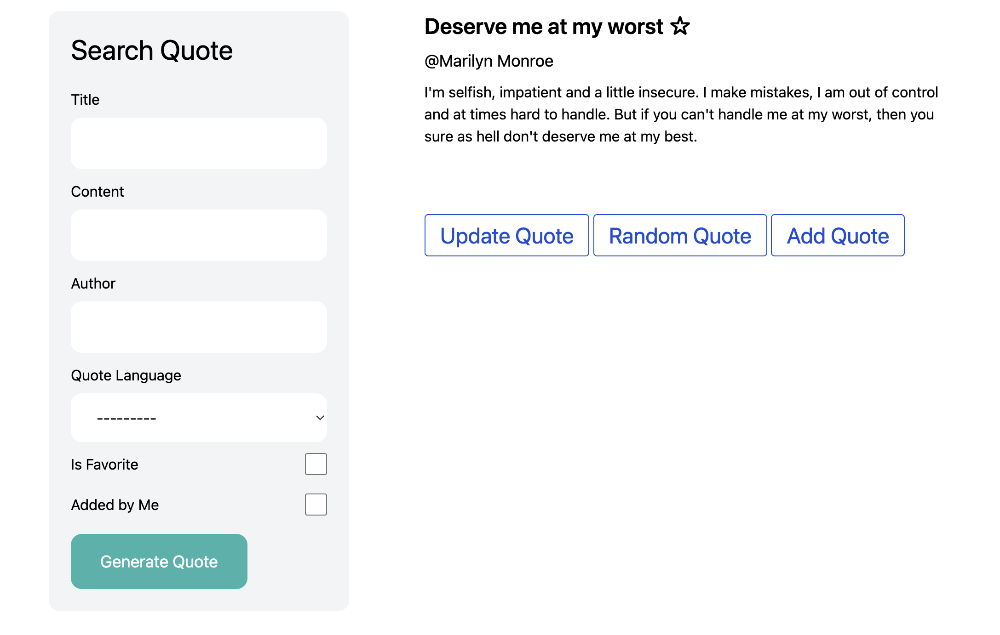
   - Możliwość sortowania cytatów przez tytuł, tekst, autora (regex), wybór języka, filtrowanie ulubionych i dodanych przez obecnego użytkownika. Jest też moliwe wyświetlenie losowego cytatu, bez żadnych filtrów.
     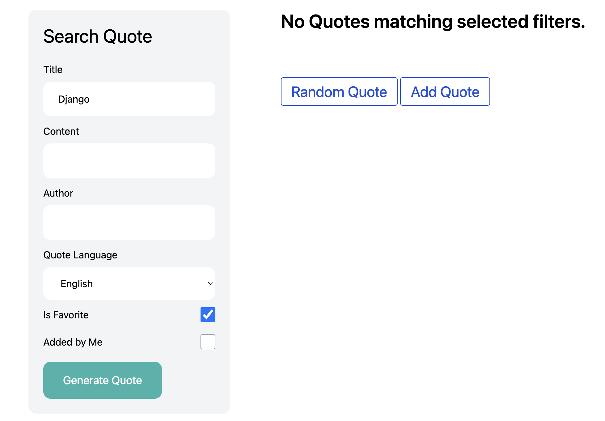
   - Możliwość dodania cytatu za pomocą edytora [tinymce](https://www.tiny.cloud/)
     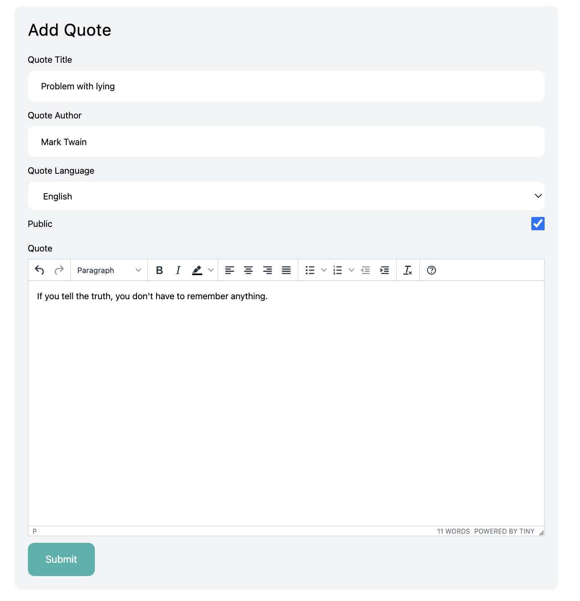
   - W przypadku zaznaczenia cytatów jako publiczny zostanie wysłane powiadomienie do admina z uprawnieniami zatwierdzania.
     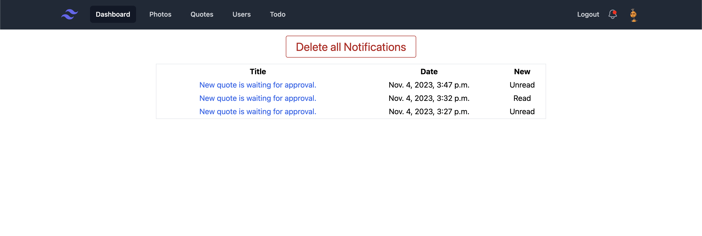
     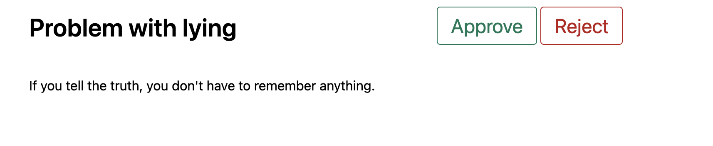
1. System powiadomien (pokazany w poprzednich punktach)
   - jest możliwość wysyłania powiadomień w emailu
     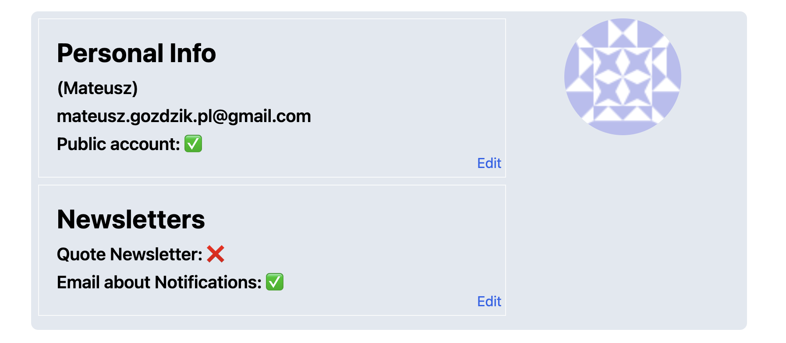
     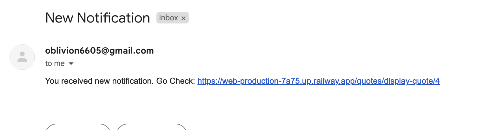
